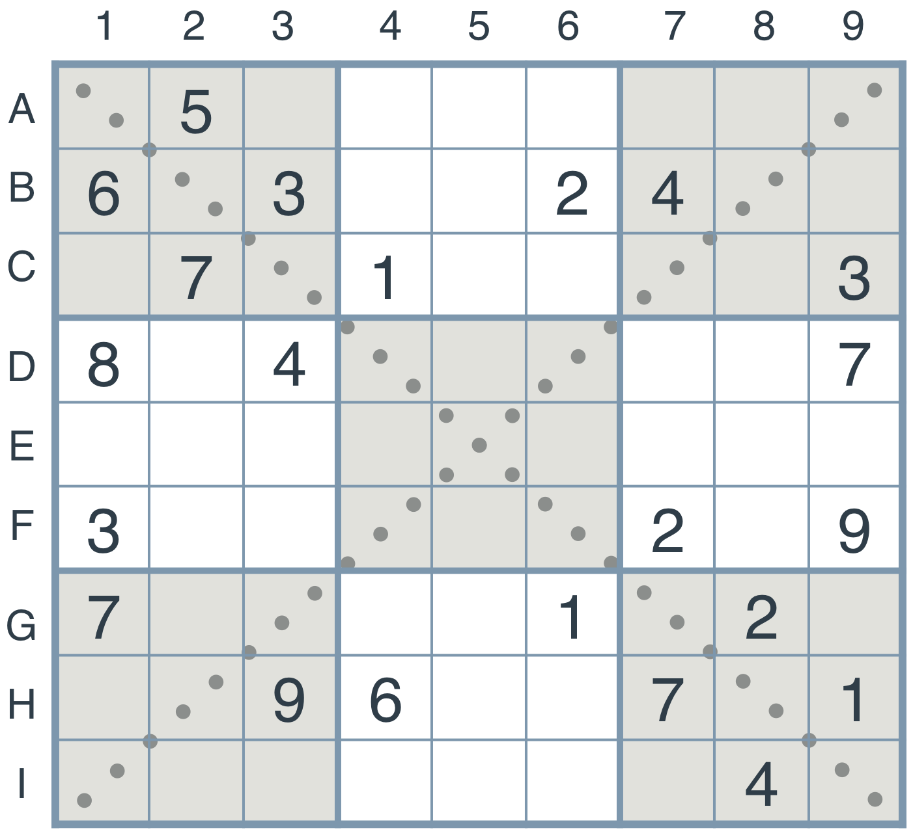

# Introductory Project: Diagonal Sudoku Solver

For this project, implemented the following extensions to the Sudoku algorithm.

## Strategy 1: Naked Twins

In this case the twin squares are evident on their own (and so they are termed 'naked' to distinguish them from the previous 'hidden' case) and these are used to exclude possibilities in other squares in the same group.

### Question 1 (Naked Twins)
Q: How do we use constraint propagation to solve the naked twins problem?  
A: A naked twins occurs when two numbers can be entered in two fields of a given area.  This strategy looks for two boxes with identical values in the same unit. From the remaining fields of this area we can eliminate these numbers. There are no two cells having the same units. First we identify potential candidates. Next we remove the digits of the naked-twin pair from the other boxes in the unit. This constraint we apply repeatedly. This constraint we use repeatedly until they stop changing.

## Strategy 2: Diagonal Sudoku

A diagonal sudoku is like a regular sudoku, except that among the two main diagonals, the numbers 1 to 9 should all appear exactly once.

### Question 2 (Diagonal Sudoku)
Q: How do we use constraint propagation to solve the diagonal sudoku problem?  
A: We use the same constraint propagation method as for normal  sudoku. However, diagonal sudoku has two additional diagonal units, which include diagonal constraints. We apply them 2 extra units. Sudoku must be resolved with numbers 1 to 9 occurring only once in each diagonal.
